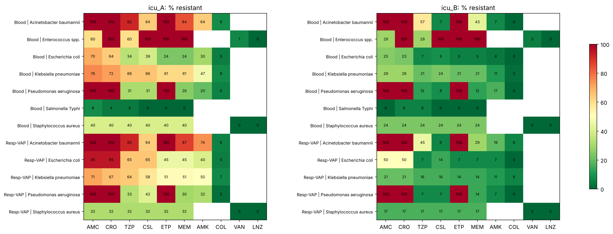

# Antibiotic Policy Engine for Indian ICUs

**Live demo:** https://YOUR-GITHUB-USERNAME.github.io/antibiotic-policy-engine/  **Try the upload yourself:** download the sample file [icu_B_whonet.csv](https://github.com/akil-2069/Antibiotic-policy-engine/blob/main/data/icu_B_whonet.csv), then upload it in the demo's "Try your own ICU" box.)*

## The problem

When a patient in an Indian ICU becomes septic, the doctor usually has to start antibiotics before culture results come back. That first choice is called *empiric therapy*, and it is often taken straight from a national guideline such as ICMR's.

National guidelines can't know what is resistant in *your* ICU. A regimen that works well in one hospital can fail in another, where most *Klebsiella* already resist carbapenems. That information exists in every microbiology lab's WHONET database, but it rarely reaches the bedside in a usable form.

## What this project does

It combines three sources that usually sit in different places and gives one recommendation for a given syndrome:

| Source | What it answers | File |
|---|---|---|
| **ICMR Treatment Guidelines (2019)** | Which regimens are allowed for this syndrome? | `data/icmr_regimens.csv` |
| **The ICU's WHONET export** | Which of those regimens still work *here*? | `data/icu_A_whonet.csv`, `data/icu_B_whonet.csv` |
| **The hospital's stewardship policy** | Which working regimen should we try first? | `data/policy.csv` |

For a chosen syndrome, the engine:

1. Takes every regimen ICMR lists for it.
2. Maps the syndrome to the matching culture type, for example ventilator pneumonia to respiratory aspirates.
3. Keeps only the first isolate per patient (the CLSI M39 rule), then measures what share of local isolates each regimen fails to cover. An isolate counts as covered if it is susceptible to at least one drug in the regimen.
4. Sorts each regimen into a tier: **Safe** (≤10% resistant), **Use with caution** (10–30%), or **No reliable option** (>30%).
5. Applies the hospital's rules: removes drugs contraindicated for this patient (e.g. colistin in kidney injury) and flags drugs that need Infectious Disease approval.
6. Ranks what's left: safest tier first, then the narrowest WHO AWaRe class, the least restricted drug, and the fewest drugs.
7. If every option is above 30%, it **does not guess**. It tells the team to send cultures and call Microbiology or Infectious Disease.

### Why the recommendation isn't made by an AI model

Antibiotic advice has to be reproducible and checkable. The core engine is plain, deterministic logic: the same input always gives the same answer, and every recommendation traces back to a resistance percentage or a policy rule. Each result carries an audit fingerprint.

AI is used where it fits. A small **RAG** component (LangChain + Ollama + FAISS) reads the full ICMR guideline PDF and answers *"why"* questions about stewardship, citing page numbers. It explains decisions and never makes them.

## Results

Same guideline and same policy, two different ICUs:

| Syndrome | ICU A (tertiary, high resistance) | ICU B (secondary, lower resistance) |
|---|---|---|
| Sepsis / septic shock | Meropenem + Colistin + Vancomycin · Safe, 2.2% · *needs ID approval* | Cefoperazone-sulbactam + Amikacin + Teicoplanin · Safe, 2.1% |
| Ventilator-associated pneumonia | Meropenem + Colistin · Safe, 4.9% · *needs ID approval* | Meropenem + Colistin · Safe, 1.8% |
| Severe community pneumonia | **Escalate**: every option is >30% resistant | Pip-tazo + Azithromycin · Safe, 8.2% |
| Intra-abdominal infection | **Escalate**: every option is >30% resistant | Pip-tazo · Use with caution, 20.7% |
| Severe undifferentiated fever | **Escalate**: every option is >30% resistant | Pip-tazo + Doxycycline · Use with caution, 18.8% |

In ICU B, the engine reaches for colistin only where it's actually needed. For sepsis it picks a Watch-class combination, because that is already safe there. In ICU A, the same syndromes push it toward Reserve drugs or a specialist call.

The same sepsis patient in ICU A **with acute kidney injury** loses every colistin, polymyxin and amikacin option. What remains is over 30% resistant, so the engine escalates instead of quietly recommending a regimen that would likely fail.



### Validation

`results/validation_tests.csv`: **11 of 11 checks pass**, including:

- tier boundaries at exactly 10% and 30%
- repeat isolates from the same patient are removed
- restricted drugs carry the ID-approval flag
- escalation triggers when nothing is reliable
- the kidney-injury flag removes nephrotoxic options
- the same input gives the same audit fingerprint
- different ICU data gives different recommendations

## Run it

**In the browser:** open the demo link. Pick an ICU and a syndrome, tick patient factors, and click any regimen to see which organisms it misses. You can also upload your own WHONET-style CSV, and it never leaves your browser.

**In Colab:** upload `Antibiotic_Policy_Engine.ipynb` → **Runtime → Run all**. It takes about 2 minutes, or about 8 with the RAG section (Ollama downloads a small model). If Ollama or the ICMR PDF download fails, it falls back to keyword retrieval and still finishes.

**Locally:**
```bash
pip install pandas numpy matplotlib scikit-learn
python make_data.py
python -c "import pandas as pd, engine as E; \
reg=pd.read_csv('data/icmr_regimens.csv'); pol=pd.read_csv('data/policy.csv'); \
sm=dict(pd.read_csv('data/specimen_map.csv').values); iso=pd.read_csv('data/icu_A_whonet.csv'); \
print(E.pretty(E.recommend('Sepsis / septic shock (unclear focus)', iso, reg, pol, sm)))"
```

**For a real ICU:** replace `data/icu_A_whonet.csv` with the unit's WHONET export (same column names: `PATIENT_ID`, `SPEC_TYPE`, `ORGANISM`, `SPEC_DATE`, one column per drug code with S/I/R) and edit `data/policy.csv` to match the hospital's restricted list. Nothing else changes.

## Turn on the demo link

1. Push this repo to GitHub as a **public** repository.
2. Go to **Settings → Pages**, set **Source** to *Deploy from a branch*, choose **main** and the **/docs** folder, and click **Save**.
3. After a minute your demo is live at `https://<your-username>.github.io/antibiotic-policy-engine/`. Put that link at the top of this README and in applications.

## Project layout

```
engine.py                       the decision engine (deterministic, ~150 lines)
make_data.py                    builds the regimen table, policy and synthetic WHONET exports
Antibiotic_Policy_Engine.ipynb  end-to-end notebook: data, engine, heatmaps, tests, RAG, Gradio UI
data/                           inputs (replace with a real ICU's files)
results/                        recommendations, antibiograms, validation tests
docs/index.html                 the browser demo (served by GitHub Pages)
```

## Limitations

- **Synthetic antibiogram data.** The two ICUs are synthetic, with resistance rates set to roughly the ranges published by ICMR's AMR surveillance network. They show how the engine behaves; they don't describe any real hospital.
- **Curated regimen table.** The table covers five syndromes and was curated by hand from the 2019 ICMR guideline. It should be checked against the current edition before any real use.
- **No dosing adjustment.** Doses are shown as written for normal kidney function. The engine doesn't adjust for weight, renal function or drug interactions.
- **Not for clinical use.** This is a student project, built to show how guideline, surveillance and policy data can be joined. It should not be used for patient care.

## References

- ICMR, *Treatment Guidelines for Antimicrobial Use in Common Syndromes*, 2nd ed., 2019. [PDF](https://www.icmr.gov.in/icmrobject/custom_data/pdf/resource-guidelines/Treatment_Guidelines_2019_Final.pdf)
- ICMR, *Antimicrobial Resistance Research and Surveillance Network Annual Report 2024*. [PDF](https://www.icmr.gov.in/icmrobject/uploads/Report/1763981012_icmramrsnannualreport2024.pdf)
- CLSI M39, *Analysis and Presentation of Cumulative Antimicrobial Susceptibility Test Data*.
- WHO AWaRe classification of antibiotics.
- WHONET microbiology laboratory database software, WHO Collaborating Centre for Surveillance of Antimicrobial Resistance.

## Author

**Akilan Murali**, B.Tech Computer Science and Engineering, VIT Vellore
